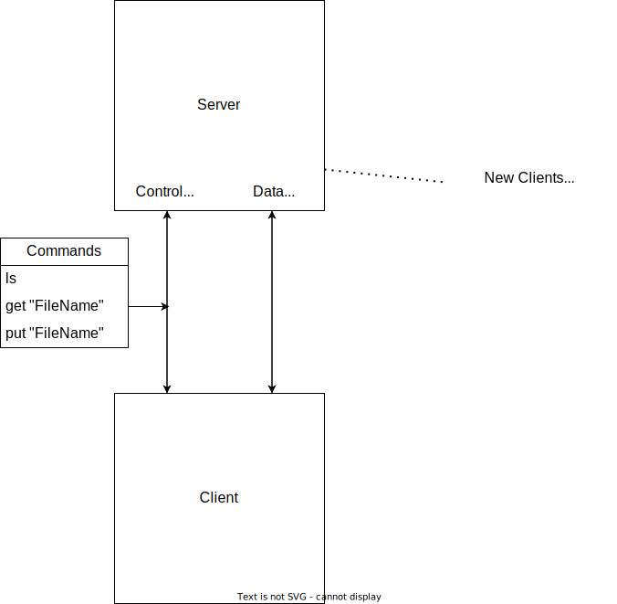

# Report

## Challenges and Solutions

### Challenge 1

Finding time to work on the project was a challenge for our group since two of our members work full-time, and have many other projects for other classes. With this in mind, we worked on the project most Thursday nights every week until the project was finished.  We also used the weekends to work on the project on our own sections, as well as talking time at the beginning of class to discuss progress and responsibilities. Simultaneous changes were handled through branches and pull requests on Github

### Challenge 2

Another challenge was understanding how socket programming works and sending packets back and forth consistently without errors. We followed the code examples given and from there we were able to come up with our own protocol built on top of the python library socket TCP protocol implementation. A large problem was recovering from or communicating errors back to the other communicator, and handling issues on both sides.

## Protocol Design

### Header

The header is 20 bytes long and contains the following fields:

- Content Length: 10 bytes, max size is 9999999999
- Data Socket Port: 5, bytes the port to open a data socket on for sending or receiving data
- Flags: 3 bytes, only used on data sockets, either a 1 or 2 to indicate that an error has occurred. 1 = generic error, 2 = file not found error

{Content Length}:{Data Socket Port}:{Flags}

### Body

Can be of length 0, or up to 9999999999 bytes long. The body is the data being sent over the socket.

### How it works

The server will open up a control socket for a client to connect to. Once a client connects the client will have the option to send a command to the server over the control socket. The server will then parse the command and send a response back to the client. If the command is a get or put command, the server will open up a data socket on the port specified in the header of the command. The client will then connect to the data socket and send the file to the server, or receive the file from the server. Once the file transfer is complete, the server will close the data socket and the client will be able to send another command to the server. If the command is a ls, the server runs the ls command in the `ftp/` directory and return all files over the data socket.

